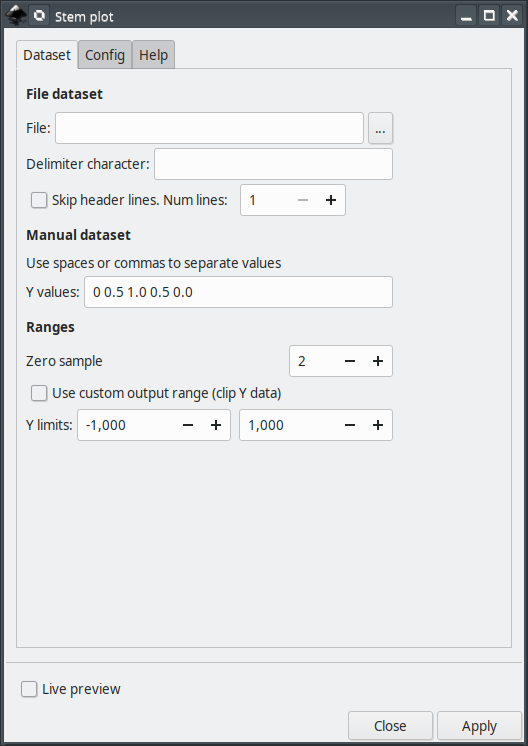
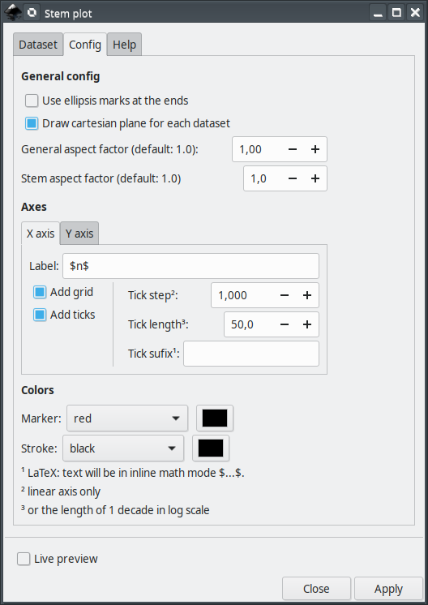

# cartesianStemPlot

This extension will assist you creating 2D stem plots (discrete data) from datasets in [Inkscape](https://inkscape.org/).


### main features

The main features are

 - optional grid lines in X and Y directions
 - adjustable tick mark intervals and sizes
 - optional LaTeX support
 - can optionally read data from text file (csv)

This extension is specially useful when used in conjunction with other mathematical tools like Octave, Matlab, R, etc. to plot data generated by these in Inkscape.

You can either provide data manually in a string 'Y values' (numbers must be separated by spaces or commas) or via text (.csv) file containing a table of Y data (column 1,2,3,...).

In case of data provided via text file, multiple plots can be generated at once by providing Y data of each plot in different columns. The same 'X values' is assumed.

## Current and older versions

Compatibility table

|  Inkscape        |  cartesianStemPlot | inkscapeMadeEasy | Receive updates?|
|------------------|-----------------|------------------|-----------------|
|       1.0        | 1.0 (latest)    |   1.0 (latest)   | YES             |
| 0.48, 0.91, 0.92 | 0.9x (obsolete) |  0.9x (obsolete) | NO              |


**Latest version:** The latest version of **cartesianStemPlot** is **1.0**. This version is compatible with Inkscape 1.0 and up only. It is **incompatible** with older Inkscape versions!

**Older versions:** If you have an older version of Inkscape, please use the files under the folder **0.9x** on Github.

**Important: Only the latest version will receive updates, new features, and bug fixes! The usage section in this documentation describes the latest version. In older versions, the disposition of the elements in the plugin's screen might be different. Some features might not be present or have different behavior.**

# Installation and requirements

Installation procedures for latest and older versions are described below.

## Requirements (all versions)

- You will need [inkscapeMadeEasy](https://github.com/fsmMLK/inkscapeMadeEasy) plugin installed. Check the compatibility table above to know the version you need.

## Installation procedure (v1.0 only)

**cartesianStemPlot** was developed using Inkscape 1.0 in Linux (Kubuntu 18.04). It should work in different OSs too as long as all requirements are met.

1. Install [inkscapeMadeEasy](https://github.com/fsmMLK/inkscapeMadeEasy), **version 1.0** (latest). Follow the instructions in the manual page. **Note:** LaTeX text is used in **cartesianStemPlot** if the support is activated (nicer results), otherwise regular text elements will be used.

2. **cartesianStemPlot** installation

    1. Go to Inkscape's extension directory with a file browser. Your inkscape extension directory can be accessed by opening Inkscape and selecting ``Edit > Preferences > System``. Look for the item **User Extensions**  field. There is a button on the right of the field  that will open a file explorer window in that specific folder.

    2. Create a subfolder in the extension directory with the name ``cartesianStemPlot``. **Important:**  Be careful with upper and lower case letters. You must write as presented above.

    3. Download **cartesianStemPlot** files and place them inside the directory you just created.

       You don't have to copy all files from Github. The files you will need are inside the ``latest`` folder. In the end you must have the following files and directories in your Inkscape extension directory.

       **LaTeX users:** You can add macros to ``inkscapeMadeEasy/basicLatexPackages.tex``. In this case the same macros will be accessible by all plugins that employ inkscapeMadeEasy.

```
        inkscape 
         ┣━━extensions
         ┋   ┣━━ inkscapeMadeEasy      <-- inkscapeMadeEasy folder
             ┃    ┣━━ inkscapeMadeEasy_Base.py
             ┃    ┣━━ inkscapeMadeEasy_Draw.py
             ┃    ┣━━ inkscapeMadeEasy_Plot.py
             ┃    ┗━━ basicLatexPackages.tex
             ┃
             ┣━━ textext               <-- texText folder (if you installed textText)
             ┃    ┋
             ┃
             ┣━━ cartesianStemPlot        <-- cartesianStemPlot folder
             ┋    ┣━━ cartesianStemPlot.inx
                  ┗━━ cartesianStemPlot.py
        
        NOTE: You might have other sub folders inside the extensions directory. They don't interfere with the plugin.
```

## Installation procedure (v0.9x only)

**cartesianStemPlot** was developed using Inkscape 0.48 and 0.91 in Linux (Kubuntu 18.04). It should work in different OSs too as long as all requirements are met.

1. Install [inkscapeMadeEasy](https://github.com/fsmMLK/inkscapeMadeEasy), **version 1.0** (latest). Follow the instructions in the manual page. **Note:** LaTeX text is used in **cartesianStemPlot** if the support is activated (nicer results), otherwise regular text elements will be used.

2. **cartesianStemPlot** installation

    1. Go to Inkscape's extension directory with a file browser.

    2. Download **cartesianStemPlot** files and place them inside the directory you just created.

       You don't have to copy all files from Github. The files you will need are inside the ``0.9x`` folder. In the end you must have the following files and directories in your Inkscape extension directory.

        ```
        inkscape
         ┣━━ extensions
         ┋    ┣━━ inkscapeMadeEasy_Base.py
              ┣━━ inkscapeMadeEasy_Draw.py
              ┣━━ inkscapeMadeEasy_Plot.py
              ┃
              ┣━━ textextLib
              ┃    ┣━━ __init__.py
              ┃    ┣━━ basicLatexPackages.tex
              ┃    ┣━━ textext.inx
              ┃    ┗━━ textext.py
              ┃
              ┣━━ cartesianStemPlot.inx        <--   from repository folder 0.9x!
              ┗━━ cartesianStemPlot.py         <--
        ```

# Usage

The extension can be found under `extensions > fsmMLK > Plot 2D > Cartesian` menu.

This extension is presented in two tabs, **Dataset** and  **Config**. The first is used to pass the data set and provide general configuration options. The second is used to configure the axes.

## Dataset tab

Here you set the dataset and adjust several general parameters. The dataset can be a file containing tabulated data (.csv)  or provided manually in two strings.



This tab contains 3 sections, described below. 
### File dataset section

If the dataset is in a tabulated text (.csv) file, use this section.

**File:** Here you can select the file containing the data (.txt or .csv). The expected file format is explained below.

The text file must be organized as a table of values. Eacho line is a sample and eacho column is a different signal. All columns must have the same number of lines.

The file can have a header with an arbitrary number of lines. In such case, you must inform the number of lines to be skipped (see below).

The separator can be any character, except the following characters: `.` (dot), `+` (plus), `-`(minus), `E`, `e`. The values can be integer or float values in decimal or exponential notation (e.g. the value 120 can also be given as 1.2e+2)

> Attention: The decimal separator must be `.` (dot). If your computer uses comma, you should fix you computer =]

Example 1:
```
4
2
0
2
4
```
the extension will create one plot.

Example 2: (delimited by semicolons, with a header containing 3 lines)
```
Hello, this is my header
second line
another one!
-2;4;0
-1;2;1
 0;0;2
 1;2;3
 2;4;4
```
the extension will create 3 plots

**Delimiter character:** Character used to delimit the columns of the file. If no character is informed, space is assumed

**Skip header lines:** Inform that the file contains a header. On the side there is a field to inform the number of lines of the header.

### Manual dataset section

**Atention: Manual dataset is used only if no text file is passed to the extension.**

**Y values:** String containing Y values of each point. The values must be separated by space or comma.

### Ranges section


**Zero sample:** Here you can set the sample that should be placed at x=0. This number cannot be outside the set of points you provided. If the number is larger than the length of the data, the last sample will be set to x=0.


**Use custom output range:** Toggle custom Y axis range. If unchecked the limits will be defined by the limits of the input data.

**Y limits:** (linear scale only) Set the range of the dependent variable (Y axis), despite of the data. On the side there are two fields for the lower and upper limits.

If Ydata has values outside the specified custom limits, then the plot will be clipped at these values. A text element will be added to the document informing it. Check your plot! See image bellow.


## Config tab

This tab has two sections. The first contains general properties of the plot and the second controls the axes.




### General config section

**Use ellipsis marks at the ends:** Use ellipsis marks at the end of the plots to indicate continuation


**Draw Cartesian plane for each dataset:** This option affects only multiple plots via input file. If checked, each plot will have its own Cartesian plane. Otherwise only the first plot will have it.

**General aspect factor:** General aspect ratio between line widths and text height. I designed this extension to have an overall aspect ratio that "looks nice". It is a function of X and Y tick lengths. With this control you can scale both line width and text height. The defauls value is 1.0.


**Stem aspect factor:** General aspect ratio of the stem markers.


### Axes section

The parameters in this section controls X and Y axes. They act on the axes the same way.

**Label:** label of the axes. If LaTeX support is activated and you want to write in mathematical environment, enclose your text with $...$.

> Tip: Since `siunitx` package is included in inkscapeMadeEasy's basicLatexPackages.tex, you can use any unit command available there too!

> Ex: `Foobar $\sqrt{x^2}$ so fancy! (\si{\newton\per\squaremetre})`


**Add grid:** Draw grid lines. The grid lines will be placed at the tick marks.

**Add ticks:** Draw tick marks with associated values. 

**Tick step:** Tick mark interval, in units of your chart. The ticks will radiate from the origin y=0.

Ex: limits from -1 to 1, with tick step of 0.5 will produce ticks at -1, -0.5, 0, 0.5, 1

**Tick length** The distance between tick marks, in units of your canvas. See image below.


**Tick suffix:** Optional extra suffix to be added to tick text. **LaTeX support enabled**: You can use any LaTeX text/commands valid in mathematical environment. You don't have to enclose your text between $...$


**Atention**: the values appended to tick mark text will NOT affect input/output limits!

### Colors section

This section controls the color of the stroke and the marker.

In both cases, you have three options in the `Color` drop down menu:

  - You can select the predefined colors. They are presented below


  - You can select **none** to set no color (transparent)


  - You can select **use color picker** to choose the color from the color picker widget just to the right of the drop down menu. **Attention:** the color selected in the color picker widget will be considered **ONLY** if you select **use color picker** in the drop down menu. 


# Observations

 - This extension does not check if your data has ``NaN`` or ``Inf`` values. Check your data.

 - The axes will be created in the center of your screen.


