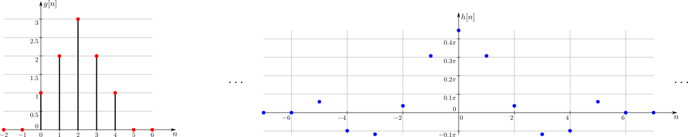
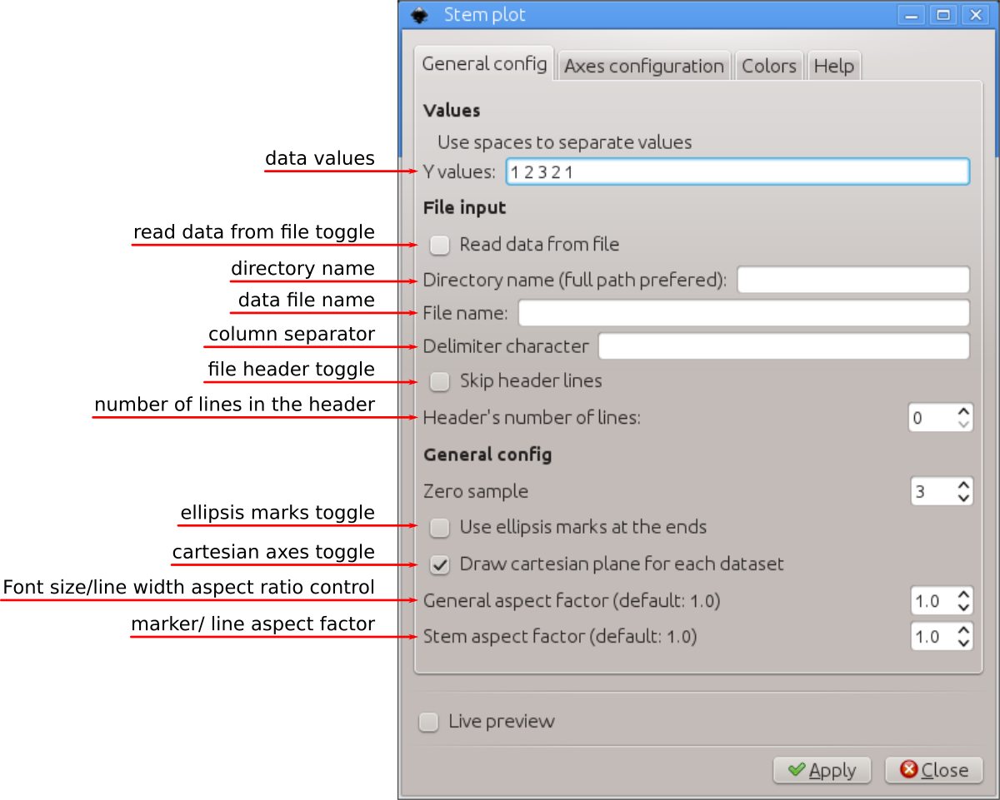
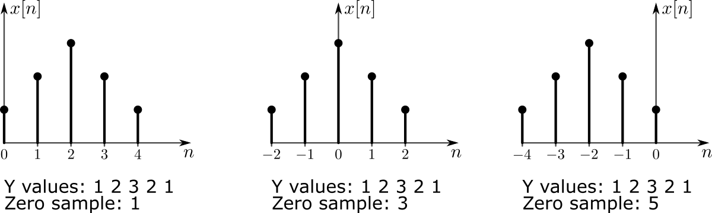
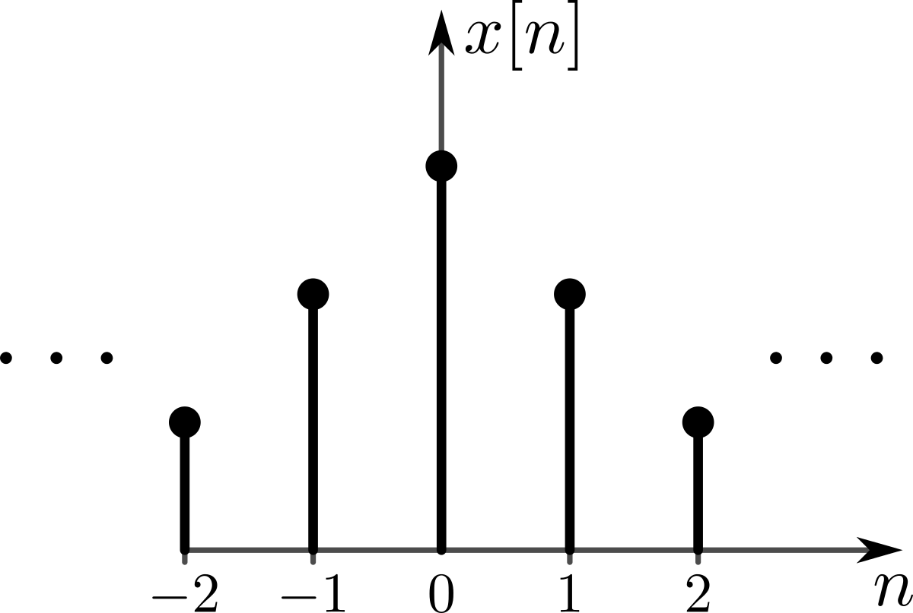
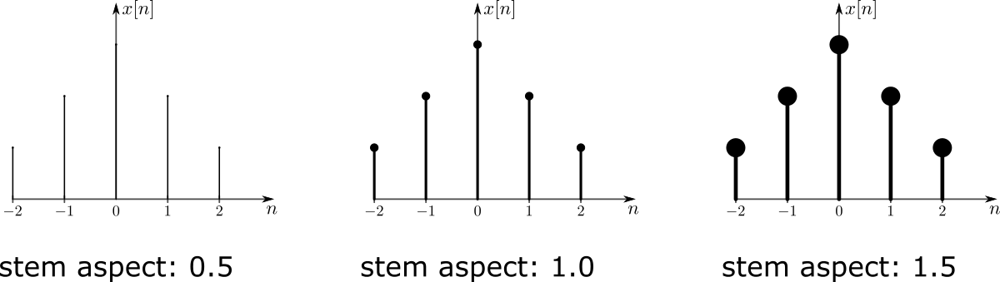
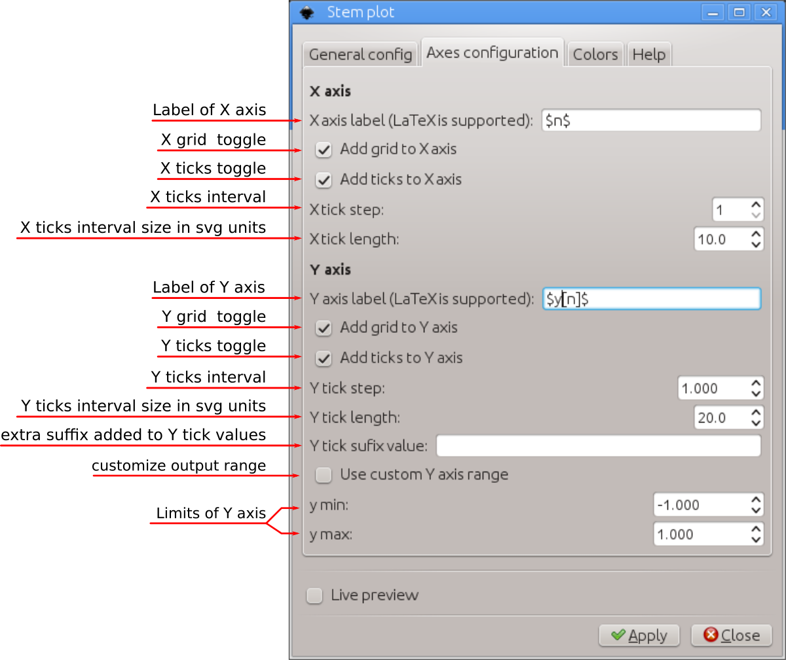
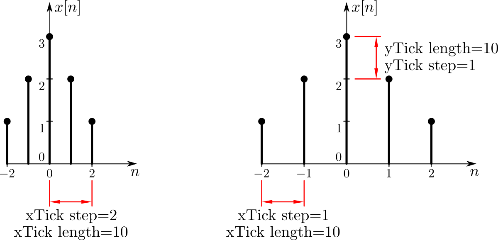
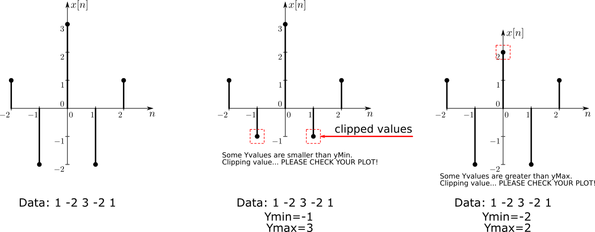
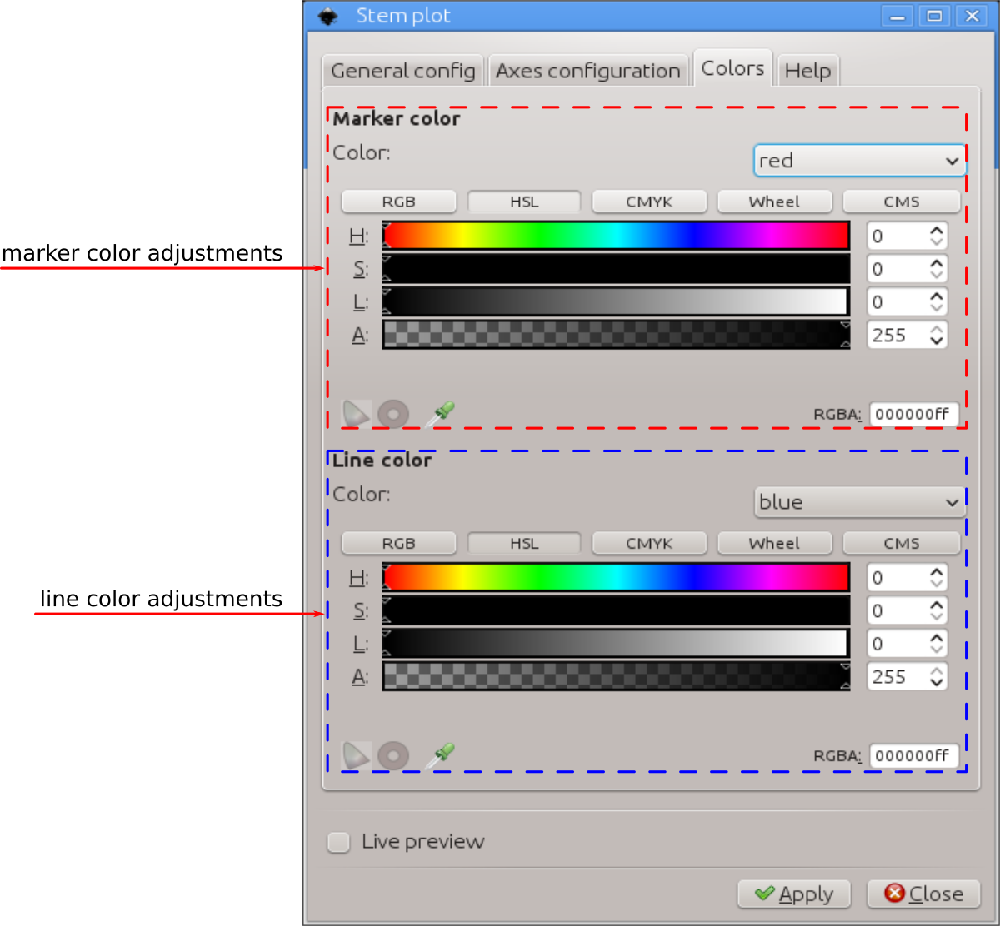
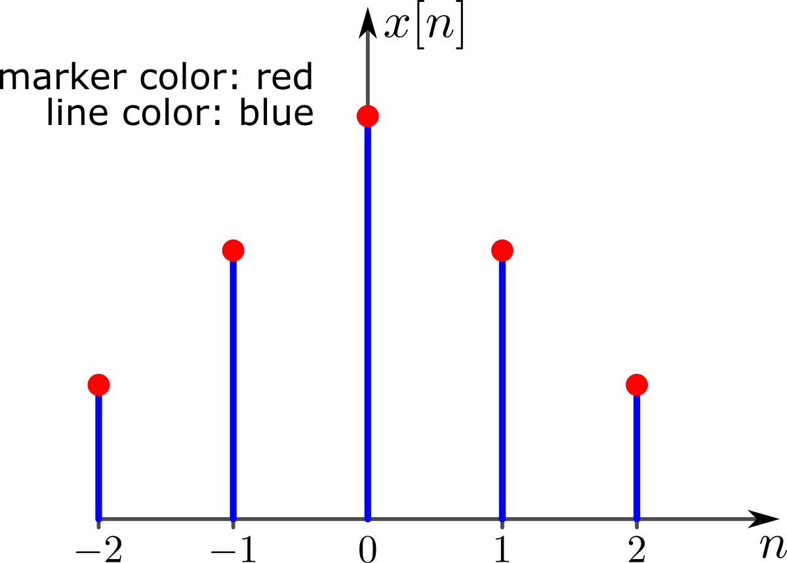

# cartesianStemPlot
 Inkscape extension to create 2D stem plot (discrete data)



### main features

The main features are

 - optional grid lines in X and Y directions
 - adjustable tick mark intervals and sizes
 - LaTeX support
 - can load data from text file

This extension is specially useful when used in conjunction with other mathematical tools, e.g. Octave, Matlab, R, etc. to plot data generated by these in Inkscape.

You can either provide the data in one string 'Y values' (numbers must be separated by spaces) or by providing the path of a text file containing a table of Y data (in columns). You can inform the preferred field separator.

In case of data provided via text file, multiple plots can be generated at once by providing Y data of each plot in different columns. The same 'X values' is assumed.

# Installation and requirements

This extension was partially developed in Inkscape 0.48 and partially in 0.91 in Linux (Kubuntu 12.04 and 14.04). It should work on both versions of Inkscape. Also, they should work in different OSs too as long as all requirements are installed.

This extension requires another extension to run, inkscapeMadeEasy <https://github.com/fsmMLK/inkscapeMadeEasy>, which contains several backstage methods and classes.

In order to use cartesianStemPlot extension, you must also download inkscapeMadeEasy files and put them inside Inkscape's extension directory. Please refer to inkscapeMadeEasy installation instructions. In the end you must have the following files and directories in your Inkscape extension directory.

```
inkscape/extensions/
            |-- inkscapeMadeEasy_Base.py
            |-- inkscapeMadeEasy_Draw.py
            |-- inkscapeMadeEasy_Plot.py
            |-- textextLib
            |   |-- __init__.py
            |   |-- basicLatexPackages.tex
            |   |-- textext.inx
            |   |-- textext.py
            |
            |-- cartesianStemPlot.py
            `-- cartesianStemPlot.inx
```

**Disabling LaTeX support of inkscapeMadeEasy**

Many of the methods implemented in inkscapeMadeEasy project use LaTeX to generate text. To this end I decided to employ the excellent extension **textext** from Pauli Virtanen  <https://pav.iki.fi/software/textext/>. 

LaTeX support via textext extension requires LaTeX typesetting system in your computer (it's free and awesome! =] ).

Since many people don't use LaTeX and/or don't have it installed, inkscapeMadeEasy's LaTeX support is now optional. **By default, LaTeX support is ENABLED.**

Please refer to <https://fsmmlk.github.io/inkscapeMadeEasy/#installation-and-requirements> on how to easily disable LaTeX support.

# Usage

The extension can be found under `extensions > fsmMLK > Plot 2D > Cartesian` menu.

This extension is presented in three tabs, **General Config**, **Axes configuration** and **Colors**. The first is used to pass the data set and provide general configuration options. The second is used to configure the axes and the third to set colors.

### The General Config tab



Here you can define your data set and set several general parameters. 

**Y values:** String containing the Y values. The values **MUST** be separated by *space*.

Attention: The extension will not check whether the values are valid (e.g. if they are numbers or not).

**Read data from file:** If you toggle this option, you can provide inkscape with a text file containing the data.

The text file must be organized as table of values. The first column is assumed to be the X data and the following columns Y data. You can provide more than one Y data set. In such case, the same X data is assumed in all plots.

All columns must have the same number of lines. The file can have one header with an arbitrary number of lines. In such case, you must inform the number of lines to be skipped (see below).

The separator can be any character, except the following characters: `.` (dot), `+` (plus), `-`(minus), `E`, `e`. The values can be integer or float values in decimal or exponential notation (e.g. the value 120 can also be given as 1.2e+2)

> Attention: The decimal separator must be `.` (dot). If your computer uses comma, you should fix you computer =]

Example 1: (delimited by spaces)
```
-2 4
-1 2
 0 0
 1 2
 2 4
```
the extension will create **one** plot where the first column is used as X data and the second as Y data

Example 2: (delimited by semicolons, with a header containing 3 lines)
```
Hello, this is my header
second line
another one!
-2;4;0
-1;2;1
 0;0;2
 1;2;3
 2;4;4
```
the extension will create two graphs, where:
  - the first  plot will employ the first column as X data and the second as Y data
  - the second plot will employ the first column as X data and the third   as Y data

> Obs: Keep in mind that all plots will be placed at the center of your screen. You will have to move them in your document.

**Directory name:** Directory path of the input file. Enter preferably the full path of the directory

**File name:** Name of the file.

**Delimiter character:** Character used to delimit the columns of the file. If no character is informed, space is assumed

**Skip header lines:** Toggle to inform that the file contains a header.

**Header's number of lines:** Number of lines to be skipped in the header.

**Zero sample:** Here you can set the sample that should be placed at x=0. This number cannot be outside the set of points you provided. If the number is larger than the length of the data, the last sample will be set to x=0.



**Use ellipsis marks at the ends:** Use ellipsis marks at the end of the plots to indicate continuation



**Draw Cartesian plane for each data set:** This option affects only multiple plots via input file. If toggled, each plot will have its own Cartesian plane. Otherwise only the first plot will have it.

**General aspect factor:** General aspect ratio between line widths and text width. I designed this extension to have an overall aspect ratio that looked nice to my eyes. It is a function of X and Y tick lengths. With this control you can scale both line widths and text height to fit your needs.


**Stem aspect factor:** General aspect ratio bof the stem markers.




### The Axes Configuration tab



**X/Y axis label:** label of the axes. This string must be LaTeX compatible. Any LaTeX commands or environments are valid. If you want to write in mathematical environment, enclose your text with $...$. You don't have to escape any backslashes.

> Tip: Since `siunitx` package is included in basicLatexPackages.tex file by default in inkscapeMadeEasy, you can use any unit command available there 

Ex: `Foobar $\sqrt{x^2}$ so fancy! (\si{\newton\per\squaremetre})`


**Add grid to X/Y axis:** Draw grid lines in X or Y axes.
   - *linear scale:* The grid lines will be placed at each tick mark
   - *logarithmic scale:* The grid lines will be placed dividing each decade in 10 parts

**Add ticks to X/Y axis:** Draw tick marks with associated values in X or Y axes.

**Xtick step:** Tick marks interval in samples.

**Ytick step:** Tick marks interval in units of your chart. The ticks will radiate from the origin y=0.

Ex: limits from -1 to 1, with tick step of 0.5 will produce ticks at -1, -0.5, 0, 0.5, 1

**X/Y tick length** The distance between the tick marks, in px.



**Y tick suffix value:** Optional extra suffix to be added to the tick values. You can use any LaTeX text/commands valid in mathematical environment $...$. You don't have to enclose your text between $...$. You don't have to escape any backslashes.


**Use custom Y axis range:** Toggle custom Y axis range of values.

**Y min and Y max:**  Set limits to the Y axis, despite of the data. The extension will inform if these limits are invalid. These values are used to limit the plot area along Y direction. For example, if your Ydata has values that do not lie within Ymin and Ymax, then the plot will be clipped at these values. A text element will be added to the document informing it.

> Note:
> Ymin must be a number less or equal to 0
> Ymax must be a number greater or equal to 0




### The Colors tab



This tab is divided in two sections. The first sets the marker color while the second to the line color.

In both sections, you have three options in the `Color` drop down menu:

  - You can select a few predefined colors. (See figure below)

  - You can select **none** to set no color (transparent)

  - You can select **use color picker** to choose the color from the color picker widget just below the `Color` drop down menu. **Attention:** the color selected in the color picker widget will be considered **ONLY** if you select **use color picker** in the drop down menu. 




Default colors


# Observations

 - This extension does not check if your data has ``NaN`` or ``Inf`` values. Check your data.

 - The axes will be created at the center of your screen.


